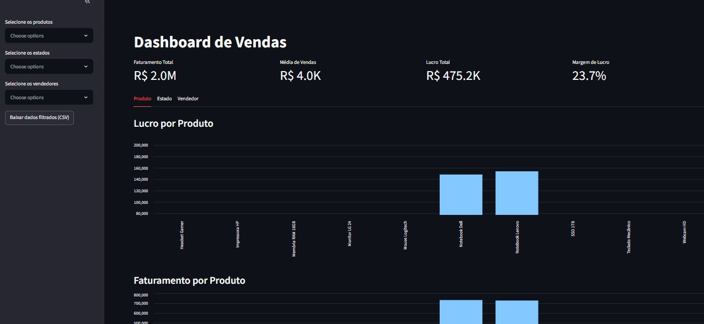

# 📊 Dashboard de Vendas

Um dashboard interativo feito com Python e Streamlit para acompanhar métricas de vendas em tempo real: faturamento, lucro, margem e desempenho por produto, estado e vendedor.

Esse projeto nasceu de um script simples que eu já tinha, mas fui evoluindo aos poucos — adicionando filtros, organizando os gráficos, cuidando da formatação dos números — até chegar num painel que realmente conta uma história com os dados, não só mostra números soltos.



## ✨ Funcionalidades

- **KPIs principais**: Faturamento Total, Média de Vendas, Lucro Total e Margem de Lucro, com valores formatados e abreviados (ex: R$ 2.0M) para facilitar a leitura
- **Filtros combinados** por Produto, Estado e Vendedor, direto na barra lateral
- **Gráficos organizados em abas**, separados por Produto, Estado e Vendedor
- **Download dos dados filtrados** em CSV, direto pelo dashboard
- **Tabela de dados detalhada**, disponível num painel expansível para quem quiser conferir os números linha a linha
- **Tratamento de erros**: mensagens claras caso o arquivo de dados esteja ausente ou com colunas faltando
- **Cache de dados** para carregamento mais rápido nas interações

## 🛠️ Tecnologias

- [Python](https://www.python.org/)
- [Streamlit](https://streamlit.io/) — framework para transformar scripts Python em aplicações web interativas
- [Pandas](https://pandas.pydata.org/) — manipulação e análise dos dados

## 🚀 Como rodar localmente

1. Clone este repositório
   ```bash
   git clone https://github.com/Luangsfe/dashboard-de-vendas-em-python
   cd dashboard-de-vendas-em-python
   ```

2. Instale as dependências
   ```bash
   pip install -r requirements.txt
   ```

3. Rode o dashboard
   ```bash
   streamlit run main.py
   ```

4. O navegador deve abrir automaticamente em `http://localhost:8501`. Se não abrir, é só acessar esse endereço manualmente.

> **Obs:** o arquivo `vendas.csv` precisa estar na mesma pasta do `main.py` para o dashboard carregar os dados corretamente.

## 📁 Estrutura esperada dos dados

O dashboard espera um arquivo `vendas.csv` com, no mínimo, estas colunas:

| Coluna | Descrição |
|---|---|
| Produto | Nome do produto vendido |
| Quantidade | Quantidade vendida |
| Valor Unitário | Preço de venda unitário |
| Custo Unitário | Custo unitário do produto |
| Estado | Estado onde a venda ocorreu |
| Vendedor | Nome do vendedor responsável |

## 💡 O que aprendi construindo isso

Esse projeto foi uma boa desculpa pra praticar bastante coisa que eu tinha meio esquecido: desde o básico de rodar um ambiente Python no Windows, passando por indentação (aquele clássico erro de `return` fora de função 😅), até conceitos mais específicos do Streamlit como `st.columns`, `st.tabs` e `st.expander` para deixar a interface mais organizada.

## 📌 Próximos passos

Algumas ideias para evoluir o projeto no futuro:
- Adicionar filtro por período de datas
- Exibir apenas os top 5 produtos/vendedores nos gráficos
- Publicar o dashboard no Streamlit Community Cloud

---

Feito com muita atenção, foco, estudo e bastante energético.